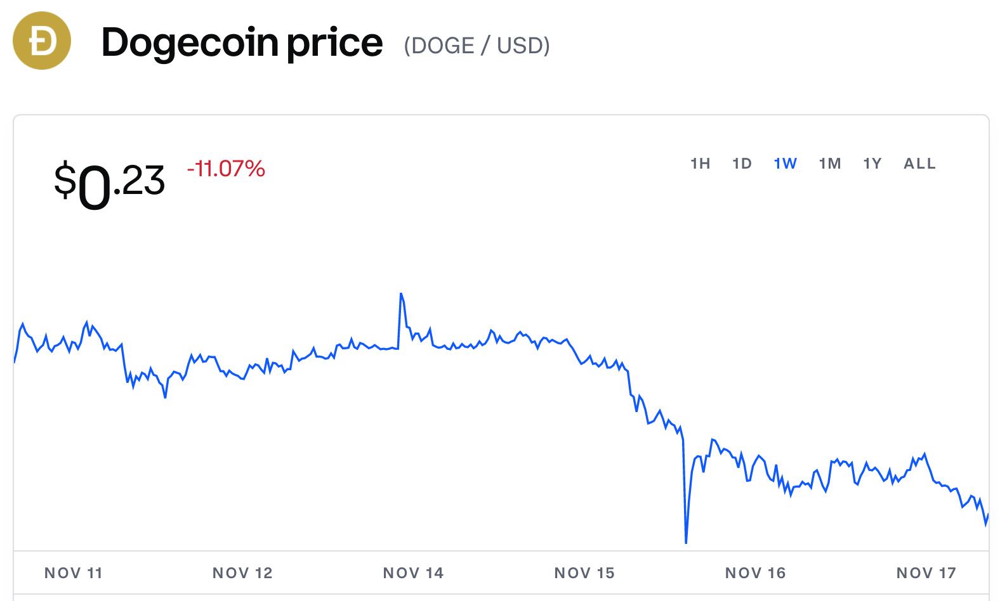
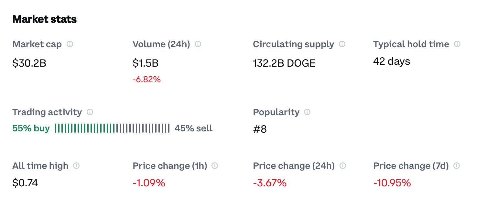

# Dogecoin Sentiment 

*Phase Four Group Project / Flatiron Data Science Bootcamp*

By: 
- [Lenore Perconti] 
- [Evan Johnson]
- [Andrew Schmeck]

## Overview

This Project is a sentiment analysis with NLP. It identifies positve vs non-positive (neutral, negative) sentiment of tweets on the topic of dogecoin.

### The Stakeholder / Business Problem
Our hypothetical stakeholder is a Marketing team for a hedgefund. As a Marketing team for a hedgefund, understanding current sentiment around dogecoin will be key to helping clients understand and navigate this market. In this projec, we analyze sentiment around Dogecoin on Twitter. Dogecoin is a cryptocurrency with a $30B market cap. Twitter is an excellent way to get a 'pulse' on public sentiment, and in this presentation we'll show you how this team explored public sentiment via a form of machine learning called sentiment analysis

### Data

Twitter API searching for dogecoin topic and excluding retweets. Our final dataset included 9,000 individual tweets between the dates of 11/12/21 and 11/19/21. 

It's worth to note as well that the value of Dogecoin declined dring this week. 





### Methods

We ran tweets through a Sentiment Intensity Analyzer without preprocessing. This provided the sentiment target (Positive, Negative, Neutral).

We then focused on preproccessing: identifying top occuring words and ngrams, and vectorizing to improve the model. We removed punctuation, lowercased all words and removed stopwords. We use textblob and sentiment intensity analyzer and creates a dataframe with the polarity, subjectivity and sentiment of the tweet.

#### Positive Reinforcement Variable
We run our n_gram finder function to generate a list of the top 300 frequently occurring words that exist in only positive tweets. The posivie sentiment column is created by checking for the existence of each word in the positive list we just created against each tweet. If a positive word exists in the tweet its positive word counter goes up by one.

For our final model we use multinomial naive bayes and feed in our vectorized data and positive word counts. We use naive bayes to help prevent overfitting. The output of this cell shows the cross validation results, the test predictions and the accuracy score of predicting on test data.

## Results

The resulting model was a sentiment analysis that predicted positive tweets with 70% precision. 

## Conclusions

Through this project we’ve found that most of the confidence in the currency is built around hype. For this reason we would want to use our model to continue to monitor dogecoin sentiment to gauge our own confidence in the coin.

We also learned thorugh this project that much of the tweet langugage used for dogecoin is slang and not always intuitive. For example, "shibu inu killer" is a positive tweet because as dogecoin's competetor, killing the value of their competetor is a good thing for dogecoin. This makes seintiment analysis challenging and requires spoon feeding the model known positive words. 

In the context of a social media campaign, modeling and predicting positive tweets could help marketing understand and correctly use buzz words in campaigns in a timely manner. This could strengthen outreach towards investors interested in looking at dogecoin.

### Next Steps

For this project we only had access to 100 tweets every hour. Dogecoin gets tweeted about much more than 100 tweets an hour, at one check we observed . An upgraded API would give us 500 tweets every hour.

We only tracked single/double words and tied them to the positive class. For future research we’d like to look at words for the negative/neutral class and also incorporating phrases to better improve the model performance.

Finally we would find it interesting to try and apply our sentiment analysis towards predicting the future price of dogecoin. We would look into seeing if there is a correlation between social media sentiment around the coin and how the coin price changes.

## For More Information

See the full analysis in the [Jupyter notebook] or for a non-technical audience, our [Presentation Slides]. 

### Repository Structure

```
├── code
│   ├── data_preparation.py
│   ├── visualizations.py
├── data
├── images
├── __init__.py
├── README.md
├── Animal_Shelter_Needs_Presentation.pdf
└── animal_shelter_needs_analysis.ipynb
```

   [Andrew Schmeck]: <https://github.com/andrewschmeckt>
   [Evan Johnson]: <https://github.com/ewjohn127>
   [Lenore Perconti]: <https://github.com/lperconti>
   [Jupyter notebook]: <https://github.com/ewjohn127/dsc_project4/blob/main/final_notebook.ipynb>
   [Presentation Slides]: <https://docs.google.com/presentation/d/1-RdROJjpZxg6GFSgrygvInLrnm52V8BgbN7G1RUI9UQ/edit?usp=sharing>
